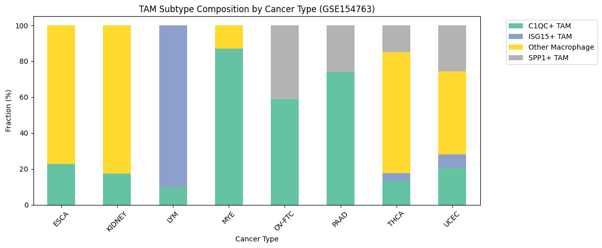
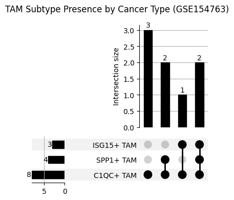

# scRNA-seq Cancer Immunology Analysis

암/면역 단일세포 RNA 시퀀싱 데이터 분석 파이프라인 구축 및 Tumor Microenvironment 연구 프로젝트


---

## Research Question
> **Phase 1**  
> "GEO 공개 데이터(GSE127465)를 직접 전처리해서 폐암 tumor-infiltrating immune cell을 UMAP으로 시각화하고 세포 타입을 annotation할 수 있는가?"

> **Phase 2**  
> "폐암 환자 TME에서 TAM은 기원에 따라 C1QC+ / SPP1+ 서브타입으로 분류되며, 이 패턴은 pan-cancer 수준에서 재현되는가?"
> 

> **Phase 3**  
> "폐암 TME에서 SPP1+ TAM이 높은 환자군은 면역치료 비반응군과 겹치는가? — scRNA-seq + H&E 이미지 공간 분포로 검증"

---

## Background
- Single-cell RNA sequencing(scRNA-seq)은 개별 세포 수준에서 유전자 발현을 측정한다.
- Tumor Microenvironment(TME)는 암세포와 면역세포, 기질세포가 공존하는 복잡한 생태계로, 면역치료 반응의 핵심 결정 인자로 주목받고 있다.
- 기존 연구는 bulk RNA-seq 중심이었으나, scRNA-seq을 통해 세포 타입별 이질성(heterogeneity)을 분해하면 치료 반응 예측에 새로운 관점을 제공할 수 있다.


---

## Paper Reproduction (Phase 2)

> Nguyen TDT, Lee AJ, Park HJ, et al.  
> **Pan-Cancer Single-Cell RNA Sequencing Analysis Refines Multi-Origin Monocyte and Macrophage Lineages**  
> *Cancer Immunol Res* 2026;14:350–66  
> Corresponding authors: Inkyung Jung (KAIST), Woong-Yang Park (Samsung Medical Center)

- Pan-cancer macrophage lineage 분류 파이프라인 재현
- GSE127465 폐암 데이터 기반으로 분석 적용 후 GSE154763 다암종 데이터로 독립 검증

### 재현 결과 (Phase 2a — GSE127465 폐암)

논문 Figure 2E와 Figure S3에 제시된 TAM subtype marker expression pattern을 기반으로 C1QC+ TAM, SPP1+ TAM 및 후보(tentative) subtype annotation을 수행하였다.

Dotplot, gene score, UMAP distribution을 종합적으로 검토한 결과, GSE127465에서도 논문에서 보고된 C1QC+ TAM 및 SPP1+ TAM과 유사한 macrophage subtype이 관찰되었다.
Marker expression이 약하거나 core subtype과 UMAP상 인접하지만 독립 cluster로 분리된 경우에는 tentative label로 보존하였으며, 이후 DEG signature overlap을 통해 대표 subtype으로 통합할지 여부를 검토하였다.
Subtype annotation의 검증에는 논문 Supplementary Table S3에 보고된 TAM subtype별 DEG signature를 사용하였다. 각 subtype의 DEG를 비교하여 논문에서 보고된 transcriptional program이 GSE127465에서도 재현되는지 평가하였다.

ISG15+ TAM은 단일 폐암 데이터에서는 독립적인 cluster로 명확하게 분리되지 않았으며, 이후 pan-cancer 데이터(GSE154763)를 이용한 확장 분석에서 별도로 확인하였다.

> Annotation reference
>
> * Figure 2E: subtype marker expression pattern
> * Figure S3: subtype functional characteristics 및 marker distribution

> Validation reference
>
> * Supplementary Table S3: TAM subtype-specific DEG signatures

### TAM subtype validation

Dotplot, gene score, UMAP distribution 및 DEG signature overlap을 함께 사용하여 TAM subtype annotation을 검토하였다.
Best overlap 결과는 subtype annotation의 단독 기준이 아니라, marker expression pattern 및 UMAP상 위치와 함께 tentative subtype 통합 여부를 판단하기 위한 보조 근거로 사용하였다.

Tentative subtype을 대표 subtype으로 통합하기 전에, 각 cluster의 DEG와 논문 Supplementary Table S3의 TAM subtype-specific DEG signature 간 overlap을 계산하였다.

| Pre-integration subtype | Best-matched paper signature | Overlap | Ratio | Representative genes | Interpretation |
|---|---|---:|---:|---|---|
| C1QC+ TAM | Resting C1QC+ TAMs | 11 / 24 | 45.8% | APOE, APOC1, C1QA, C1QB, TREM2, VSIG4 | Supports C1QC-associated annotation |
| C1QC+ TAM (tentative) | Resting C1QC+ TAMs | 17 / 24 | 70.8% | C1QA, C1QB, C1QC, APOE, SELENOP, HLA-DRA | Supports integration with C1QC-associated TAM |
| SPP1+ TAM | SPP1+ TAMs | 1 / 9 | 11.1% | SPP1 | Limited DEG overlap; supported mainly by marker expression |
| SPP1+ TAM (tentative) | SPP1+ TAMs | 2 / 9 | 22.2% | CXCL3, SPP1 | Partial SPP1-associated signal |
| Unknown | No matched signature | 0 | 0.0% | - | Kept as unknown myeloid population |

C1QC+ TAM과 C1QC+ TAM(tentative)는 모두 Resting C1QC+ TAM signature와 가장 높은 overlap을 보여, 두 cluster를 C1QC-associated TAM으로 통합할 근거를 제공하였다.
SPP1+ TAM과 SPP1+ TAM(tentative) 역시 SPP1+ TAM signature와 best match되었으나 overlap gene 수는 제한적이었기 때문에 dotplot의 marker expression 및 UMAP 분포와 함께 보조 근거로 해석하였다.
Unknown myeloid cluster는 tested TAM subtype signature와 명확한 overlap을 보이지 않아 C1QC/SPP1 subtype으로 강제 병합하지 않았다.


### Sample-level TAM composition

Tentative subtype을 대표 subtype으로 통합한 후 sample별 TAM composition을 비교하였다.
대부분의 sample에서 C1QC-associated TAM이 SPP1-associated TAM보다 높은 비율로 관찰되었으며, sample 간 composition heterogeneity가 확인되었다.


### Key observations
- C1QC-associated TAM은 대부분의 sample에서 SPP1-associated TAM보다 높은 비율로 관찰되었다.
- Sample 간 TAM composition은 상당한 heterogeneity를 보였다.
- 현재 정의한 subtype(C1QC/SPP1)만으로 모든 macrophage cluster를 설명할 수는 없었으며, 추가적인 macrophage state가 존재할 가능성을 확인하였다.

### 다암종 확장 분석 (Phase 2b — GSE154763, 8개 암종)

GSE154763은 이미 myeloid cell subset과 MajorCluster annotation이 제공된 pan-cancer datset이다.
따라서 본 단계에서는 raw count 기반 QC, normalization, clustering을 새로 수행하지 않고, 제공된 normalized expression matrix와 cell type annotation을 활용하였다.

MajorCluster label에 포함된 C1QC, SPP1, ISG15 keyword를 기준으로 macrophage subtype을 매핑한 뒤, 암종별 TAM subtype composition을 비교하였다.
따라서 Phase 2b는 de novo subtype discovery가 아니라, 외부 annotation을 이용한 pan-cancer composition extension으로 해석하였다.
 
**암종별 TAM subtype 구성 비율 (%):**
 
| 암종 | C1QC+ | SPP1+ | ISG15+ | Other |
|---|---|---|---|---|
| ESCA | 22.8 | 0.0 | 0.0 | 77.2 |
| KIDNEY | 17.5 | 0.0 | 0.0 | 82.5 |
| LYM | 9.9 | 0.0 | 90.1 | 0.0 |
| MYE | 86.9 | 0.0 | 0.0 | 13.1 |
| OV-FTC | 58.7 | 41.3 | 0.0 | 0.0 |
| PAAD | 74.2 | 25.8 | 0.0 | 0.0 |
| THCA | 13.3 | 15.0 | 4.3 | 67.4 |
| UCEC | 20.6 | 25.6 | 7.6 | 46.2 |

**UpSet Plot 주요 결과**
- C1QC+ TAM - 8개 암종 전부 존재 (보편적 패턴)
- SPP1+ TAM - 4개 암종에만 존재 (OV-FTC, PAAD, THCA, UCEC)
- ISG15+ TAM - 3개 암종에만 존재 (LYM 90.1%, THCA, UCEC)
- **Phase 2a 한계였던 ISG15+ TAM이 다암종 확장에서 확인됨** -> 단일 암종 데이터의 한계 검증 완료




---

## Methodology

```
GEO 공개 데이터 다운로드 (폐암 tumor-infiltrating immune cells)
       ↓
QC → Normalization → HVG 선택 → PCA → UMAP → Clustering
       ↓
세포 타입 annotation (Marker gene 기반)
       ↓
TAM 서브타입 세분화 (C1QC-associated / SPP1-associated / tentative)
       ↓
marker expression 기반 subtype 검토 (dotplot, UMAP, gene score)
       ↓
DEG 분석 (Wilcoxon)
       ↓
Supplementary Table S3 signature validation
       ↓
Tentative subtype 통합 및 TAM composition 분석
       ↓
TME 세포 구성 분석 (샘플별 / 암종별 TAM 비율)
       ↓
다암종 확장 (GSE154763, 8개 암종) — 독립 검증
       ↓
UpSet plot — 암종별 TAM subtype 조합 패턴 시각화
       ↓
결과 시각화 (UMAP, dotplot, heatmap, violin plot)
```

---
## Project Structure

```
scrna-cancer-immunology/
├── README.md
├── requirements.txt
├── .gitignore
├── docs/
│   ├── bioinformatics_concepts.md       ← 용어정리
│   └── environment.md
├── phase0_basics/
│   ├── data/
│   │   └── pbmc3k_raw.h5ad
│   └── 01_pbmc_tutorial.ipynb           ← Scanpy 기초 파이프라인 실습
├── phase1_scrna/
│   ├── dataset/
│   │   ├── GSE127465_gene_names_human_41861.tsv
│   │   └── GSE127465_RAW/               ← raw tsv 파일들
│   └── 01_geo_pipeline.ipynb            ← GEO 실데이터 전처리 파이프라인
├── phase2_analysis/
│   ├── 01_myeloid_subset.ipynb       ← 골수계 서브셋팅 + TAM annotation (2a)
│   ├── 02_DEG_analysis.ipynb         ← DEG + overlap 확인 + dotplot (2a) + 다암종 DEG (2b)
│   └── 03_TME_composition.ipynb      ← TME 구성 분석 (2a + 2b)
└── phase3_project/
    ├── 01_preprocessing.ipynb
    ├── 02_clustering_annotation.ipynb
    ├── 03_TAM_treatment_response.ipynb
    ├── 04_HE_image_analysis.ipynb       ← DINOv2 feature 추출
    ├── 05_integration_visualization.ipynb
    ├── src/
    │   ├── preprocess.py
    │   ├── clustering.py
    │   ├── annotation.py
    │   ├── visualization.py
    │   └── image_features.py            ← DINOv2 feature 추출
    └── results/
        └── figures/
```
---

## Data
이 프로젝트는 GEO 공개 데이터를 사용합니다.

| 소스 | 데이터셋 | 내용 | Phase |
|------|----------|------|-------|
| GEO (NCBI) | GSE127465 | 폐암 tumor-infiltrating immune cells scRNA-seq | Phase 1~2a |
| GEO (NCBI) | GSE154763 | 8개 암종 골수계 세포 pan-cancer atlas (Set 1) | Phase 2b |
| GEO (NCBI) | GSE131907 | 폐선암 LUAD (~208k cells) | Phase 2b 예정 |
| GEO (NCBI) | GSE122960 | 정상 폐 (Healthy lung) | Phase 2b 예정 |

## GSE127465 다운로드 방법
1. https://www.ncbi.nlm.nih.gov/geo/query/acc.cgi?acc=GSE127465 접속
2. 아래 파일 다운로드:
   - GSE127465_RAW.tar
3. 압축 풀고 dataset/raw 폴더에 위치
## GSE154763 다운로드 방법
1. https://www.ncbi.nlm.nih.gov/geo/query/acc.cgi?acc=GSE154763 접속
2. 아래 파일 다운로드:
   - ESCA, KIDNEY, LYM, MYE, OV-FTC, PAAD, THCA, UCEC
   - 각각 metadata + normalized_expression 쌍
3. 압축 풀고 dataset/phase2b 폴더에 위치


---

## Study Log
| Phase | 기간 | 내용 | 상태 |
|-------|------|------|------|
| Phase 0 | 2026.04.21 ~ 2026.04.28 | 환경 세팅 + Scanpy 기초 | ✅ 완료 |
| Phase 1 | 2026.04.30 ~ 2026.05.10 | GEO 실데이터 scRNA-seq 파이프라인 (GSE127465 폐암) | ✅ 완료 |
| Phase 2a | 2026.05.16 ~ 2026.05.22 | TAM 서브타입 annotation + DEG 분석 + 논문 기반 검증 | ✅ 완료 |
| Phase 2b | 2026.05.23 ~ 2026.06.01 | 다암종 확장 — GSE154763, GSE131907 통합 검증 | 🔄 진행중 |
| Phase 3 | 2026.12~ | 메인 프로젝트 — scRNA-seq × H&E 이미지 통합 분석 | ⏳ 예정 |

---

## Pipeline Design

분석 파이프라인은 `src/` 모듈로 분리되어 있어 데이터셋 교체 시 파라미터 설정만으로 재실행 가능

```python
from src.preprocess import run_qc, normalize
from src.clustering import run_umap, run_leiden
from src.annotation import annotate_celltypes
from src.visualization import plot_umap, plot_heatmap

# 데이터셋만 바꾸면 전체 파이프라인 재실행 가능
adata = run_qc(data_path="data/GSE127465")
adata = normalize(adata)
adata = run_umap(adata, n_pcs=30, resolution=0.5)
adata = annotate_celltypes(adata, marker_genes=LUNG_MARKERS)
plot_umap(adata, color="cell_type", save="results/figures/umap.png")
```
---

## Tech Stack

- Python — Scanpy, Harmony, pandas, matplotlib, seaborn, upsetplot
- Jupyter Notebook

---

## Environment

```bash
conda env create -f environment.yml
conda activate spatial
```

패키지 상세 내역: [docs/environment.md](docs/environment.md)

본 분석은 Windows 환경에서 재현성을 확인하였다.
PCA, UMAP, Leiden 단계에는 'random_state = 42'를 지정했으나, OS 및 패키지 버전 차이에 따라 결과가 일부 달라질 수 있다.
동일 환경 내 재실행 시 결과가 일관적으로 재현되는지를 기준으로 삼았다.

---

## Branch Strategy

| 브랜치 | 역할 |
|--------|------|
| main   | 최종 결과 |
| dev    | 개발 브랜치 |
| feature/* | 기능/실험 단위 |

---

## Commit Convention

| 타입 | 설명 |
|------|------|
| feat | 기능 추가 |
| analysis | 데이터 분석 |
| fix | 버그 수정 |
| refactor | 코드 개선 |
| wip | 실험 중 |

---

## Notes
- 바이오 용어 단어장: See [docs/bioinformatics_concepts.md](docs/bioinformatics_concepts.md)
