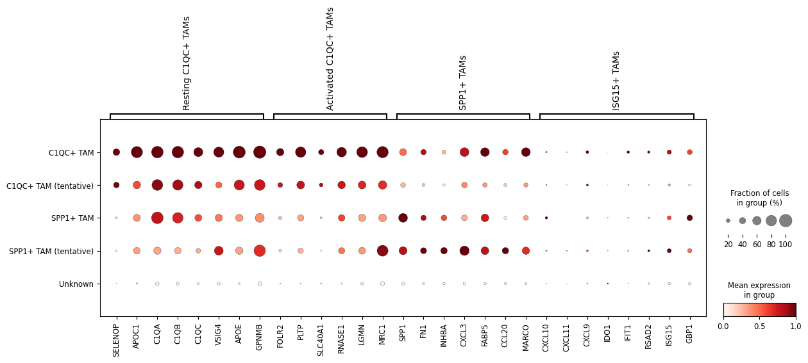
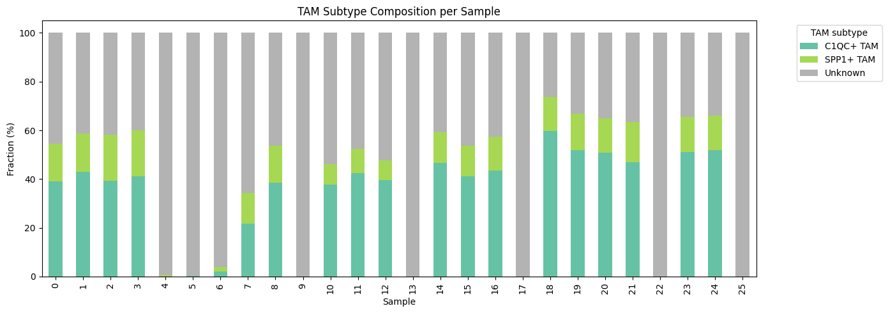
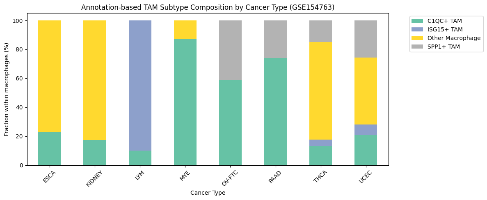
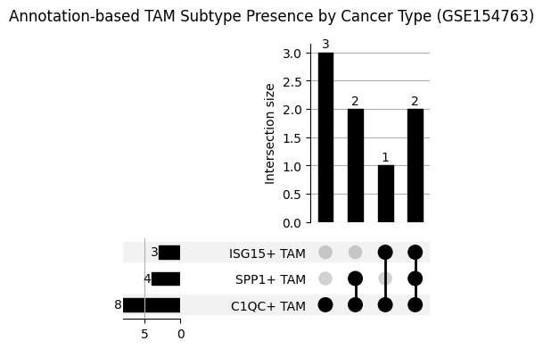
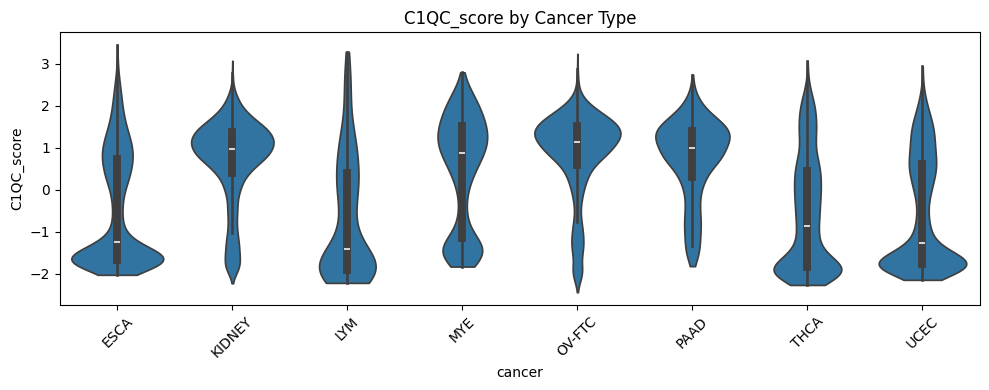
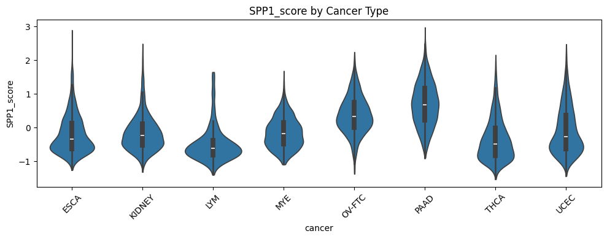
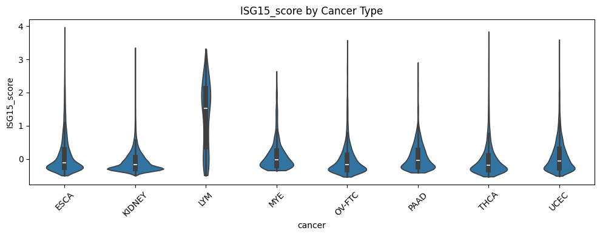
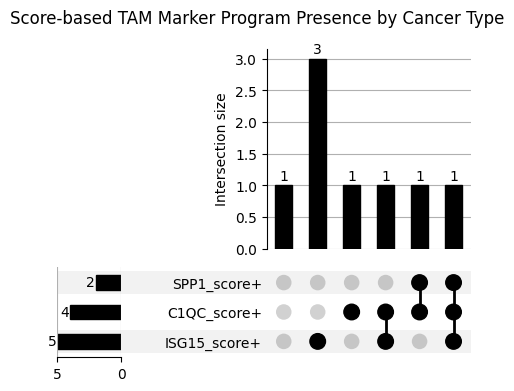

# scRNA-seq Cancer Immunology Analysis

Single-cell RNA sequencing pipeline for reproducible macrophage-associated immune state characterization in lung cancer tumor microenvironment

---

## Research Question
> **Phase 1**  
> GEO 공개 데이터(GSE127465)를 직접 전처리해서 폐암 tumor-infiltrating immune cell을 UMAP으로 시각화하고 세포 타입을 annotation할 수 있는가?

> **Phase 2a, b**  
> "폐암 TME에서 C1QC-associated, SPP1-associated 및 ISG15-associated TAM program은 단일 코호트에서 어떤 전사적 상태로 관찰되는가? 또한 별도 pan-cancer 공개 데이터에서 이와 관련된 macrophage distribution은 암종별로 어떻게 나타나는가?"
> 

> **Phase 2c**  
> “TAM-associated state composition의 차이는 샘플 수준의 immune ecosystem과 어떤 관계를 보이는가?”
> 

> **Phase 3**  
> “scRNA-seq에서 정의한 C1QC-associated 및 SPP1-associated TAM program은 종양 조직 내에서 서로 다른 spatial niche 및 local cellular context와 연관되는가?”
> 

---

## Background
- Single-cell RNA sequencing(scRNA-seq)은 개별 세포 수준에서 유전자 발현을 측정한다.  
- Tumor Microenvironment(TME)는 암세포와 면역세포, 기질세포가 공존하는 복잡한 생태계로, 면역치료 반응의 핵심 결정 인자로 주목받고 있다.  
- 기존 연구는 bulk RNA-seq 중심이었으나, scRNA-seq을 통해 세포 타입별 이질성(heterogeneity)을 분해하면 치료 반응 예측에 새로운 관점을 제공할 수 있다.  
- 본 프로젝트는 TAM-associated transcriptional state를 세포 단위에서 탐색한 뒤 sample-level immune ecosystem 및 spatial niche와의 연결을 단계적으로 분석하는 것을 목표로 한다.


---

# Phase 2: Macrophage-Associated Immune State Analysis

본 분석은 Nguyen et al. (Cancer Immunol Res, 2026)에서 보고된 pan-cancer macrophage lineage 분류 체계를 참조하여,  
GSE127465 폐암 데이터에서 C1QC-, SPP1-, ISG15-associated TAM program의 전사적 특징을 탐색하고 별도 pan-cancer 데이터에서 관련 macrophage state distribution을 비교하였다.

> Reference: Nguyen TDT et al., Cancer Immunol Res 2026;14:350–66  
> Corresponding authors: Inkyung Jung (KAIST), Woong-Yang Park

### Pipeline Correction Note
Phase 2 분석 중 `adata.raw`가 HVG selection 이후 시점에 백업되어, DEG 분석에 사용된 expression matrix의 gene coverage가 의도치 않게 축소된 상태였음을 확인하였다.
이를 수정하여 log-normalization 단계의 전체 gene을 보존한 matrix 기준으로 DEG 분석을 재실행하였으며, 본 README의 수치는 수정 후 결과를 반영한다.
수정 전후 결과 비교는 phase2 troubleshooting log issue 6에 기록되어 있다.


---

## 재현 결과 (Phase 2a — GSE127465 폐암)

 논문 Figure 2E와 Figure S3에 제시된 TAM subtype marker expression pattern을 기반으로 C1QC+ TAM, SPP1+ TAM 및 후보(tentative) subtype annotation을 수행하였다.

 Dotplot, gene score, UMAP distribution을 종합적으로 검토한 결과, GSE127465에서도 논문에서 제시된 C1QC-associated 및 SPP1-associated transcriptional program과 유사한 macrophage population이 관찰되었다. 
Marker expression이 약하거나 core subtype과 UMAP상 인접하지만 독립 cluster로 분리된 경우에는 tentative label로 보존하였으며, 이후 DEG signature overlap을 통해 대표 subtype으로 통합할지 여부를 검토하였다.  
Subtype annotation의 검증에는 논문 Supplementary Table S3에 보고된 TAM subtype별 DEG signature를 사용하였다.    

 ISG15+ TAM은 단일 폐암 데이터(GSE127465)에서는 독립적인 cluster로 명확하게 분리되지 않았으며, 이후 pan-cancer 데이터(GSE154763)를 이용한 확장 분석에서 별도로 확인하였다.

> Annotation reference
> * Figure 2E: subtype marker expression pattern
> * Figure S3: subtype functional characteristics 및 marker distribution
 
> Validation reference
> * Supplementary Table S3: TAM subtype-specific DEG signatures

---

### TAM subtype validation

Dotplot, gene score, UMAP distribution 및 DEG signature overlap을 함께 사용하여 TAM subtype annotation을 검토하였다.
Best overlap 결과는 subtype annotation의 단독 기준이 아니라, marker expression pattern 및 UMAP상 위치와 함께 tentative subtype 통합 여부를 판단하기 위한 보조 근거로 사용하였다.  

Tentative subtype을 대표 subtype으로 통합하기 전에, 각 cluster의 top 50 DEG와 논문 Supplementary Table S3의 TAM subtype-specific DEG signature 간 overlap을 계산하였다.  

| Pre-integration subtype | Best-matched paper signature | Overlap | Ratio | Representative genes | Interpretation |
|---|---|---:|---:|---|---|
| C1QC+ TAM | Activated C1QC+ TAMs | 19 / 30 | 63.3% | SELENOP, FOLR2, PLTP, SLC40A1, C1QA, C1QB | Activated C1QC-like transcriptional program |
| C1QC+ TAM (tentative) | Resting C1QC+ TAMs | 13 / 24 | 54.2% | FTL, CTSD, APOE, GPNMB, C1QA, C1QB, APOC1 | Resting C1QC-like / lysosomal-enriched feature |
| SPP1+ TAM | SPP1+ TAMs | 7 / 9 | 77.8% | SPP1, FABP5, MARCO, FN1, CXCL3, INHBA, SDC2 | SPP1-associated transcriptional program 강하게 재현 |
| C1QC/SPP1 mixed-signature TAM | — (ambiguous) | — | — | APOE, TREM2, CTSD 등 C1QC feature > SPP1 core; SPP1, FABP5 등 SPP1 feature > C1QC tentative | 두 axis를 함께 보이는 mixed-signature population |
| Unresolved | No matched signature | 0 / — | 0% | FCN1, CFP, SELL, CORO1A | Monocyte-like / inflammatory myeloid population |

C1QC+ TAM과 C1QC+ TAM(tentative)는 모두 C1QC-associated signature와 가장 높은 overlap을 보여, 두 cluster를 C1QC-associated TAM으로 통합할 근거를 제공하였다.  
SPP1+ TAM core는 reference signature 9개 중 7개(77.8%)가 재현되었으며, SPP1 자체가 2위 DEG로 확인되었다.  
Unresolved myeloid cluster는 tested TAM subtype signature와 명확한 overlap을 보이지 않아 C1QC/SPP1 subtype으로 강제 병합하지 않았다.  

  


---

### Core population 직접 비교 검증 (DEG-B)

C1QC+ TAM core와 SPP1+ TAM core를 직접 비교(Wilcoxon, Bonferroni)하여, vs-rest DEG에서 도출된 transcriptional 차이가 두 population 간 직접 비교에서도 유지되는지 확인하였다.  
- C1QC+ TAM 우세 유전자: SELENOP, C1QA, C1QB, C1QC, PLTP, FOLR2, SLC40A1, F13A1, LGMN, DAB2, RNASE1  
- SPP1+ TAM 우세 유전자: SPP1, MCEMP1, RETN, VCAN, FCN1, CLEC5A, S100A8, FABP5, FN1, INHBA  

DEG-A(vs rest)에서 확인된 두 core population의 transcriptional 차이는 direct comparison에서도 동일하게 유지되었다.  
또한 SPP1+ TAM core에서 RETN, VCAN, FCN1, CLEC5A, S100A8 등이 상대적으로 높게 나타나, 해당 population이 일부 monocyte-like 또는 inflammatory myeloid feature를 동반한 SPP1-associated state임을 시사한다.  


---

### Ambiguous population 귀속 검증 (DEG-C)

기존 `SPP1+ TAM(tentative)`로 분류된 population은 reference signature overlap에서 Resting C1QC+ TAM signature와 더 높은 overlap을 보였으나, marker score 기반 annotation에서는 SPP1 axis가 상대적으로 높아 최종 subtype assignment가 불확실하였다.  

이에 두 방향의 direct DEG comparison을 수행하였다.  

**ambiguous vs SPP1+ TAM core:**  
ambiguous population에서 C1QB, C1QA, C1QC, APOE, FTL, TREM2, CTSD, GPNMB 등의 발현이 유의하게 높았다.  
→ SPP1 core에 비해 C1QC-associated lipid/lysosomal feature를 강하게 보유  
 
**ambiguous vs C1QC+ TAM (tentative):**  
ambiguous population에서 SPP1, FABP5, MARCO, SDC2, FN1, INHBA, CXCL3, CCL20 등의 발현이 유의하게 높았다.  
→ C1QC tentative에 비해 SPP1-associated feature를 명확히 보유  
 
종합하면, 해당 population은 C1QC+ TAM(tentative)도 SPP1+ TAM core도 아닌, 두 transcriptional axis를 함께 보이는 `C1QC/SPP1 mixed-signature TAM`으로 최종 재어노테이션하였다.  
본 분석은 transcriptional comparison 기반이며, 실제 분화 경로의 intermediate state임을 직접 입증한 것은 아니다.  


---

### Final annotation summary

| 최종 subtype | 특징 | 세포 수 |
|---|---|---|
| C1QC+ TAM | Activated C1QC-like transcriptional program | 1534 |
| C1QC+ TAM (tentative) | Resting C1QC-like / lysosomal-enriched | 1386 |
| SPP1+ TAM | SPP1-associated program 강하게 재현 | 973 |
| C1QC/SPP1 mixed-signature TAM | 두 axis 혼재 (이전: SPP1+ TAM tentative) | 943 |
| Unresolved | Monocyte-like / C1QC·SPP1 framework 외부 | 4731 |


---

### Sample-level TAM composition

TAM subtype 통합 기준:
- C1QC+ TAM(tentative)는 DEG 및 gene set score 기준으로 C1QC+ core와 유사한 transcriptional program을 공유하여 C1QC-associated TAM으로 통합하였다.  
- C1QC/SPP1 mixed-signature TAM은 DEG-C 분석에서 두 transcriptional axis가 혼재하는 별도 population으로 확인되어 독립 카테고리로 유지하였다.  
- SPP1+ TAM(core)는 독립 유지하였다.  
- Unresolved는 현재 C1QC/SPP1/ISG15 framework으로 포착되지 않는 cell들로, annotation 오류가 아닌 sample 간 TME 구성의 이질성을 반영한다.

위 4종 기준으로 sample별 TAM composition을 비교하였다. 대부분의 sample에서 C1QC-associated TAM이 가장 높은 비율로 관찰되었으며, sample 간 composition heterogeneity가 확인되었다. 특정 sample(4, 5, 6, 9, 13, 17, 22, 25)에서는 TAM subtype이 전혀 포착되지 않았으며, 전체 TME 구성 분석 결과 해당 sample들이 macrophage-poor TME 환경임을 확인하였다.  



---

### Key observations

- C1QC-associated TAM은 대부분의 sample에서 가장 높은 비율(28~44%)로 관찰되었으며, GSE127465 폐암 데이터에서 dominant한 TAM state임을 확인하였다.  
- SPP1+ TAM은 전체적으로 낮은 비율(7~15%)로 sample 간 편차가 적었다.  
- C1QC/SPP1 mixed-signature TAM은 sample에 따라 0~17%까지 편차가 크며, 특정 sample에 집중되는 패턴이 관찰되었다.  
- Sample 간 TAM composition은 상당한 heterogeneity를 보였으며, 동일한 폐암(NSCLC) 환자라도 TME 구성이 크게 다름을 확인하였다.  
- SPP1+ TAM core는 reference signature 9개 중 7개(77.8%)가 top 50 DEG에 재현되었으며, direct comparison(DEG-B)에서도 transcriptional 분리가 유지되었다.  
- 기존 SPP1+ TAM(tentative)는 DEG-C 검증 결과 C1QC/SPP1 mixed-signature TAM으로 재분류되었다.  
- 특정 sample(4, 5, 6, 9, 13, 17, 22, 25)은 전체 TME에서 macrophage 비율이 10% 미만인 macrophage-poor sample로 확인되었으며, 이는 annotation 한계가 아닌 환자 간 TME 구성의 실질적 이질성을 반영한다.  
- 현재 정의한 subtype(C1QC/SPP1)만으로 모든 macrophage cluster를 설명할 수는 없었으며, Unresolved population 등 추가적인 macrophage state가 존재할 가능성을 확인하였다.  


---

## 다암종 확장 분석 (Phase 2b — GSE154763, 8개 암종)

 GSE154763은 이미 myeloid cell subset과 MajorCluster annotation이 제공된 pan-cancer datset이다.
따라서 본 단계에서는 raw count 기반 QC, normalization, clustering을 새로 수행하지 않고, 제공된 normalized expression matrix와 cell type annotation을 활용하였다.

 MajorCluster label에 포함된 C1QC, SPP1, ISG15 keyword를 기준으로 macrophage subtype을 매핑한 뒤, 암종별 TAM subtype composition을 비교하였다.
따라서 Phase 2b는 de novo subtype discovery가 아니라, 외부 annotation을 이용한 pan-cancer composition extension으로 해석하였다.

#### A. Annotation-based strict subtype

**암종별 TAM subtype 구성 비율 (%):**
본 비율은 전체 cell 대비 비율이 아니라, 각 암종의 macrophage population 내부에서 C1QC+ TAM, SPP1+ TAM, ISG15+ TAM, Other Macrophage가 차지하는 비율이다.
 
| tam_subtype | C1QC+ TAM | ISG15+ TAM | Other Macrophage | SPP1+ TAM | n_macrophages |
|---|---|---|---|---|---|
| ESCA |	22.8 |	0.0 |	77.2	| 0.0 |	4825 |
| KIDNEY |	17.5 |	0.0	| 82.5 |	0.0 |	8796 |
| LYM |	9.9 |	90.1 |	0.0 |	0.0 |	293 |
| MYE |	86.9 |	0.0 |	13.1	| 0.0	| 1156 |
| OV-FTC |	58.7	| 0.0 |	0.0	| 41.3 |	3278 |
| PAAD	| 74.2 |	0.0 |	0.0	| 25.8	| 1379 |
| THCA |	13.3	| 4.3 |	67.4	| 15.0 |	3326 |
| UCEC |	20.6 |	7.6 |	46.2	| 25.6	| 4194 |

**Stacked bar Plot 주요 결과**
- LYM: ISG15+ TAM 90.1% - 다른 암종과 뚜렷하게 구분
- MYE, PAAD: C1QC+ TAM 우세
- OV-FTC, PAAD: C1QC+ + SPP1+ 공존
- ESCA, KIDNEY: Other Macrophage 비중 높음
- THCA, UCEC: 세 subtype + Other 모두 관찰



**UpSet Plot 주요 결과**
- C1QC+ TAM - 8개 암종 전부 존재 (보편적 패턴)
- SPP1+ TAM - 4개 암종에만 존재 (OV-FTC, PAAD, THCA, UCEC)
- ISG15+ TAM - 3개 암종에만 존재 (LYM 90.1%, THCA, UCEC)
- GSE127465 단일 폐암 코호트에서는 ISG15-associated population이 명확히 분리되지 않았으나, 별도 pan-cancer annotation 기반 분석에서는 ISG15 label을 포함한 macrophage population이 일부 암종에서 관찰되었다.  
 => 이는 코호트·암종·annotation 기준에 따라 ISG15-associated signal의 관찰 양상이 달라질 수 있음을 시사한다.  



### 최종 결과 분석
암종별 macrophage composition은 TAM subtype 구성에서 뚜렷한 차이를 보였다.

기존 MajorCluster annotation 기준에서 C1QC label을 포함한 macrophage population은 8개 암종 전체에서 관찰되었으, MYE(86.9%), PAAD(74.2%), OV-FTC(58.7%)에서 우세하였다. ISG15+ TAM은 LYM에서 90.1%로 압도적이었고, THCA·UCEC에서 소량 관찰되었다. SPP1+ TAM은 OV-FTC, PAAD, THCA, UCEC 4개 암종에서만 관찰되었으며, 나머지 암종에서는 strict annotation 기준으로 존재하지 않았다.

세 subtype이 모두 공존한 암종은 THCA와 UCEC였으며, C1QC+ TAM 단독으로만 나타난 암종은 ESCA, KIDNEY, MYE였다.

모든 암종의 macrophage heterogeneity를 C1QC/SPP1/ISG15 세 subtype만으로 설명하기는 어렵다.
본 단계는 제공 annotation과 normalized expression matrix에 기반한 exploratory composition anaysis이며, 암종 간 직접적인 biological effect 또는 clinical outcome 차이를 검정하는 분석으로 해석하지 않는다.

#### B. Marker score-based validation
Annotation-based strict subtype 분석은 기존 MajorCluster 이름에 의존한다.  
따라서 cluster 이름에는 C1QC/SPP1/ISG15가 없지만, marker expression상 특정 subtype과 유사한 cluster가 있을 수 있다.

이를 확인하기 위해 C1QC_score, SPP1_score, ISG15_score를 계산하여 기존 annotation과 marker expression 경향이 일치하는지 검증하였다.

**Cancer-level score tendency 확인**

| tam_subtype | C1QC_score | ISG15_score | SPP1_score |
|---|---|---|---|
| ESCA	| -0.484 |	-0.201	| 0.121 |
| KIDNEY |	0.716 |	-0.162	| -0.063 |
| LYM |	-0.683 |	-0.489	| 1.294 |
| MYE	| 0.449 |	-0.153	| 0.122 |
| OV-FTC |	0.859	| 0.379 |	-0.006 |
| PAAD |	0.744	| 0.695	| 0.068 |
| THCA	| -0.583 |	-0.363	| -0.001 |
| UCEC	| -0.601 |	-0.096	| 0.103 |

**Cancer-level subtype score violin 주요 결과**





**Optional: score-based marker program presence**

> 본 분석은 탐색적(exploratory) 분석으로, threshold(score > 0) 기준에 따라 결과가 달라질 수 있다. Annotation-based strict subtype과 동일한 수준의 확정적 결론으로 해석하지 않는다.

| tam_subtype | C1QC_score | ISG15_score | SPP1_score |
|---|---|---|---|
| ESCA |	False |	False	| True |
| KIDNEY |	True |	False	| False |
| LYM |	False |	False	| True |
| MYE	| True |	False	| True |
| OV-FTC |	True	| True |	False |
| PAAD |	True	| True	| True |
| THCA	| False |	False	| False |
| UCEC	| False |	False	| True |

**Score-based TAM Marker Presence UpSet plot 주요 결과**



---

# Methodology

```
[Phase1] GEO 공개 데이터 다운로드 (폐암 tumor-infiltrating immune cells)
       ↓
QC → Normalization → HVG 선택 → PCA → UMAP → Clustering
       ↓
세포 타입 annotation (Marker gene 기반)
       ↓
[phase 2a]TAM 서브타입 세분화 (C1QC-associated / SPP1-associated / tentative)
       ↓
marker expression 기반 subtype 검토 (dotplot, UMAP, gene score)
       ↓
DEG 분석 (Wilcoxon)
       ↓
Supplementary Table S3 signature validation
       ↓
Tentative subtype 통합 및 TAM composition 분석
       ↓
TME 세포 구성 분석 (샘플별 / 암종별 TAM 비율)
       ↓
[phase 2b] 다암종 확장 (GSE154763, 8개 암종)
       ↓
UpSet plot — 암종별 TAM subtype 조합 패턴 시각화
       ↓
[Phase 2c] sample-level immune ecosystem analysis
       ↓
sample별 TAM-associated state composition 계산
       ↓
sample별 T cell / Treg / DC / NK 등 immune composition 계산
       ↓
TAM state composition × immune ecosystem association 분석
       ↓
robustness / permutation-based exploratory evaluation
       ↓
[Phase 3] spatial transcriptomics 기반 TAM niche analysis
       ↓
spatial dataset 선정 및 QC
       ↓
scRNA-seq reference 기반 cell-type mapping 또는 signature scoring
       ↓
C1QC-associated / SPP1-associated TAM program의 spatial distribution 추정
       ↓
주변 세포 조성 및 spatial neighborhood 비교
       ↓
spatial niche 및 local cellular context 해석
```

---
# Project Structure

```
scrna-cancer-immunology/
├── README.md
├── requirements.txt
├── .gitignore
├── docs/
│   ├── bioinformatics_concepts.md       ← 용어정리
│   └── environment.md
├── phase0_basics/
│   ├── data/
│   │   └── pbmc3k_raw.h5ad
│   └── 01_pbmc_tutorial.ipynb           ← Scanpy 기초 파이프라인 실습
├── phase1_scrna/
│   ├── dataset/
│   │   ├── GSE127465_gene_names_human_41861.tsv
│   │   └── GSE127465_RAW/               ← raw tsv 파일들
│   ├── 01_geo_pipeline.ipynb            ← GEO 실데이터 전처리 파이프라인
│   └── 02_troubleshooting_log.ipynb     ← phase1 트러블슈팅 로그
├── phase2_analysis/
│   ├── 01_myeloid_subset.ipynb       ← 골수계 서브셋팅 + TAM annotation (2a)
│   ├── 02_DEG_analysis.ipynb         ← DEG + overlap 확인 + dotplot (2a)
│   ├── 03_TME_composition.ipynb      ← TME 구성 분석 (2a)
│   ├── 04_pancancer_TAM_validation.ipynb  ← pan-cancer annotation + marker score validation (2b)
│   ├── 05_immune_ecosystem.ipynb
│   └── 06_troubleshooting_log.ipynb  ← phase2 트러블슈팅 로그
└── phase3_project/
    ├── 01_visium_preprocessing.ipynb    ← Visium paired 데이터 로드 + QC
    ├── 02_spatial_tam_scoring.ipynb     ← spot별 C1QC / SPP1 score 계산
    ├── 03_he_feature_extraction.ipynb   ← H&E 패치 → DINOv2 feature 추출
    ├── 04_integration_analysis.ipynb    ← gene score × morphological feature 상관 분석
    ├── 05_spatial_visualization.ipynb   ← TAM subtype 공간 분포 시각화
    ├── src/
    │   ├── spatial_preprocess.py
    │   ├── tam_scoring.py
    │   ├── annotation.py
    │   ├── image_features.py            ← DINOv2 feature 추출 (pretrained)      
    │   └── visualization.py
    └── results/
        └── figures/
```
---

# Data
이 프로젝트는 GEO 공개 데이터를 사용합니다.

| 소스 | 데이터셋 | 내용 | Phase |
|------|----------|------|-------|
| GEO (NCBI) | GSE127465 | 폐암 tumor-infiltrating immune cells scRNA-seq | Phase 1~2a |
| GEO (NCBI) | GSE154763 | 8개 암종 골수계 세포 pan-cancer atlas (Set 1) | Phase 2b |
| GEO (NCBI) | GSE131907 | 폐선암 LUAD (~208k cells) | Phase 2b 예정 |
| GEO (NCBI) | GSE122960 | 정상 폐 (Healthy lung) | Phase 2b 예정 |
| TBD | scRNA-seq + Visium paired (폐암 또는 CRC) | spatial transcriptomics + H&E | Phase 3 |

**Phase 3 데이터 선정 기준**  
- tumor tissue spatial transcriptomics expression matrix 및 spatial coordinate 제공
- macrophage/TAM-associated signal을 평가할 수 있는 coverage
- 가능한 경우 multiple patient 또는 section 포함
- 가능하면 lung cancer 우선, 데이터 적합성이 낮으면 다른 solid tumor로 확장
- matched scRNA-seq 또는 reference annotation 제공 시 우선순위 상승
- H&E image 및 clinical metadata는 선택 조건

## GSE127465 다운로드 방법

1. https://www.ncbi.nlm.nih.gov/geo/query/acc.cgi?acc=GSE127465 접속
2. 아래 파일 다운로드:
   - GSE127465_RAW.tar
3. 압축 풀고 dataset/raw 폴더에 위치

## GSE154763 다운로드 방법

1. https://www.ncbi.nlm.nih.gov/geo/query/acc.cgi?acc=GSE154763 접속
2. 아래 파일 다운로드:
   - ESCA, KIDNEY, LYM, MYE, OV-FTC, PAAD, THCA, UCEC
   - 각각 metadata + normalized_expression 쌍
3. 압축 풀고 dataset/phase2b 폴더에 위치


---

# Study Log
| Phase | 기간 | 내용 | 상태 |
|-------|------|------|------|
| Phase 0 | 2026.04.21 ~ 2026.04.28 | 환경 세팅 + Scanpy 기초 | ✅ 완료 |
| Phase 1 | 2026.04.30 ~ 2026.05.10 | GEO 실데이터 scRNA-seq 파이프라인 (GSE127465 폐암) | ✅ 완료 |
| Phase 2a | 2026.05.16 ~ 2026.05.22 | TAM 서브타입 annotation + DEG 분석 + 논문 기반 검증 | ✅ 완료 |
| Phase 2b | 2026.05.23 ~ 2026.06.01 | 다암종 확장 — GSE154763 통합 검증 | ✅ 완료 |
| 중간점검 | 2026.06.02 ~ 2026.6.24 | score_genes 결과 해석 추가 + interpretation note 보완 및 전체적인 수정 + 검증 추가 | ✅ 완료 |
| Phase 2c | 2026.07 ~ | sample-level TAM state composition과 immune ecosystem 연관성 탐색 | 🔄 진행중 |
| Phase 3 데이터 서치 | 2026.08 ~ | tumor spatial transcriptomics 공개 데이터 및 reference mapping 전략 선정 | ⏳ 예정 |
| Phase 3 | 2026.09 ~ | TAM-associated program의 spatial niche 및 local cellular context 탐색 | ⏳ 예정 |

---

# Pipeline Design (Phase 3 예정)

Phase 3에서는 분석 파이프라인을 `src/` 모듈로 분리하여 데이터셋 교체 시 파라미터 설정만으로 재실행 가능하도록 설계할 예정이다.
현재는 `utils/` 패키지로 경로 관리 및 validation helper를 모듈화하였다.

---

# Tech Stack

- Python - Scanpy, Harmony, pandas, matplotlib, seaborn, upsetplot
- Spatial analysis 예정 - Squidpy, cell2location 또는 RCTD
- Jupyter Notebook

---

# Environment

```bash
conda env create -f environment.yml
conda activate spatial
```

패키지 상세 내역: [docs/environment.md](docs/environment.md)

 본 분석은 Windows 환경에서 재현성을 확인하였다.  
PCA, UMAP, Leiden 단계에는 'random_state = 42'를 지정했으나, OS 및 패키지 버전 차이에 따라 결과가 일부 달라질 수 있다.  
동일 환경 내 재실행 시 결과가 일관적으로 재현되는지를 기준으로 삼았다.  

---

## Branch Strategy

| 브랜치 | 역할 |
|--------|------|
| main   | 최종 결과 |
| dev    | 개발 브랜치 |
| feature/* | 기능/실험 단위 |

---

## Commit Convention

| 타입 | 설명 |
|------|------|
| feat | 기능 추가 |
| analysis | 데이터 분석 |
| fix | 버그 수정 |
| refactor | 코드 개선 |
| wip | 실험 중 |

---

# Notes
- 바이오 용어 단어장: See [docs/bioinformatics_concepts.md](docs/bioinformatics_concepts.md)
